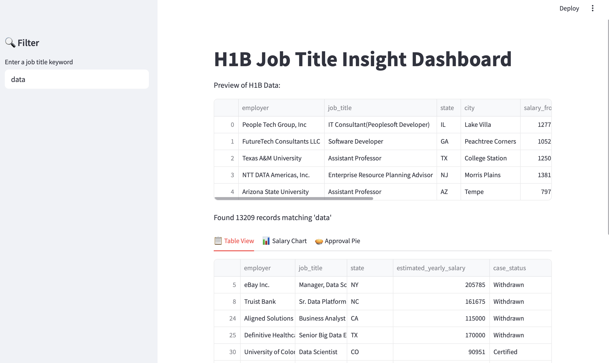
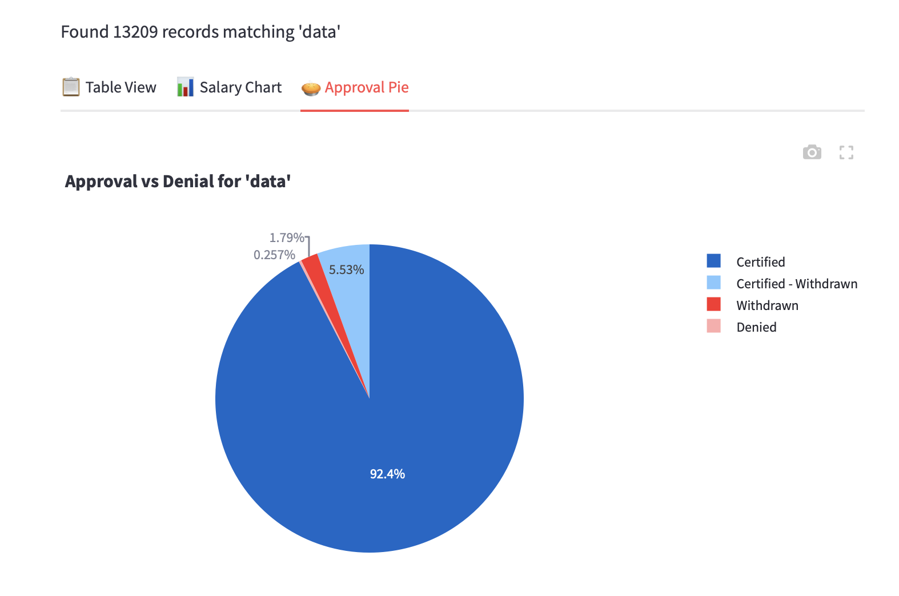
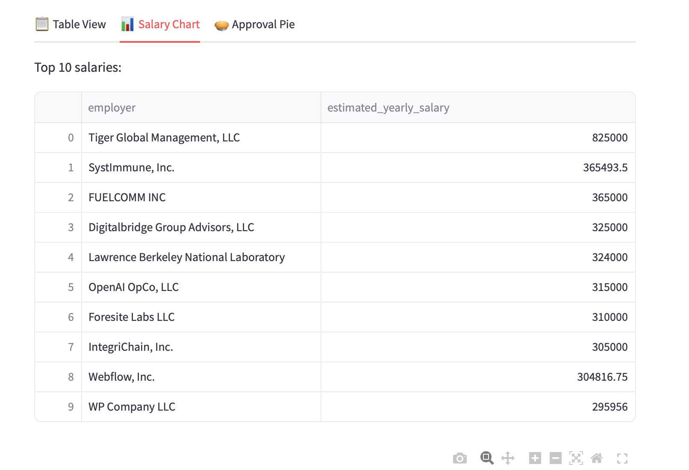
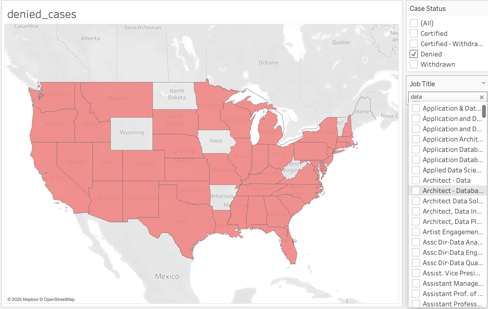

# H1BView: H1B Job Title Insight Dashboard

Currently, this is a lightweight, interactive dashboard that helps international students explore job sponsorship trends by job title, using FY2025 Q2 LCA Disclosure Data.

Built with `Streamlit`, `Pandas`, `Plotly`, and `SQL`, this project serves as both a career research tool and a data-driven résumé booster.

Used Tableau to visualize the case status distribution across the US using a job-title filter and geographic heat map

---

## Purpose

**Why this project?**

Many international students struggle to understand which jobs, companies, and roles have higher H1B sponsorship potential. This dashboard provides a first step toward exploring this question using real U.S. government labor condition application (LCA) disclosure data.

> Note:  
> Although the project originally planned to **compare LCA filings with USCIS H-1B approval data**, the dataset showing the actual approval of H1B, this feature is temporarily postponed for the following reasons:
>
> - **USCIS 2025 data not fully released**  
> - **FY2024 and FY2025 use different selection rules**: a new lottery mechanism effective March 2024 significantly alters approval logic, which causes recent datasets to just represent a transitional trend
> - To ensure accurate, meaningful cross-source comparisons, deeper restructuring will be needed (planned for future phases)

---

## Features

### Current Functionalities (Streamlit)

- Search job titles using keyword input  
- Filter and preview case details: employer, title, state, estimated salary, and case status  
- Visualize:
  - **Top 10 employers** on bar chart
  - **Approval vs Denial rate** on pie chart
- Download filtered results as CSV

### Other Visualizations (Tableau)

- U.S. map of **case status distribution** by job title filter  
- Future enhancements may include wage range and location filters

---

## Screenshot

## Try the dashboard
# Dataset
Due to file size limits and regular government updates, the dataset is not included in this repository.

To run this project:

1. Visit the [U.S. Department of Labor H1B Disclosure Data](https://www.dol.gov/agencies/eta/foreign-labor/performance)
2. Download the FY2025 Q2 LCA Disclosure Data (Excel or CSV format)
3. Save the file as: `data/h1b_clean_2025.csv`

# How to Run

pip install -r requirements.txt
streamlit run app/app.py

## Contributing

This project is open to contributions!

You're welcome to:

- Update the dataset when new quarters or fiscal years are released
- Improve dashboard UI or filtering logic
- Add comparisons to USCIS data when available

Suggest features or open issues

🌟 Ideal for international students, data analysts, and career-minded coders.

