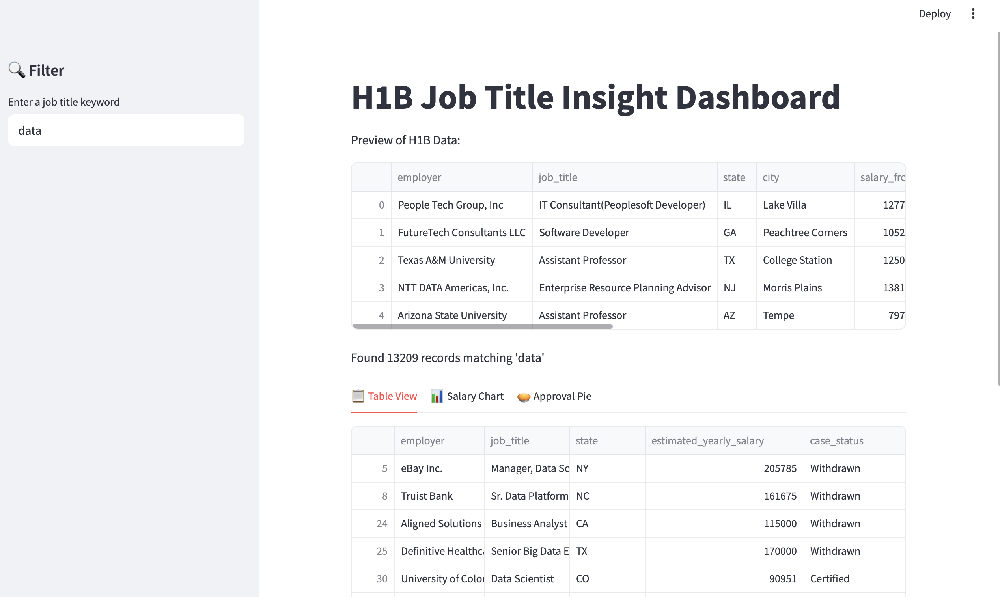
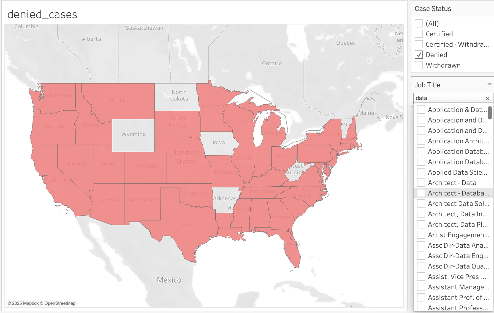
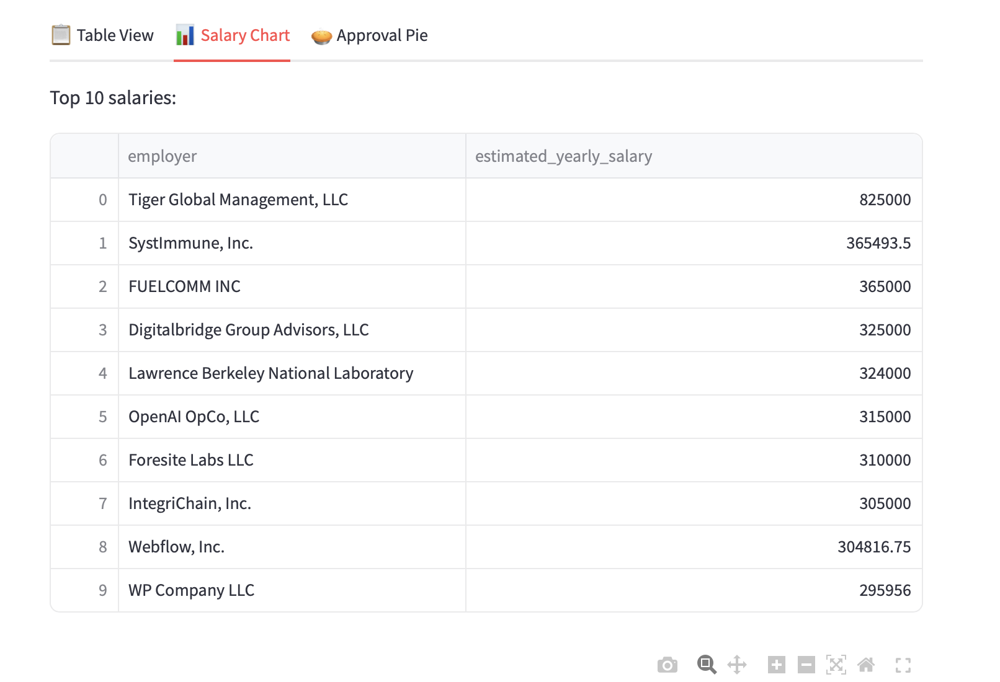
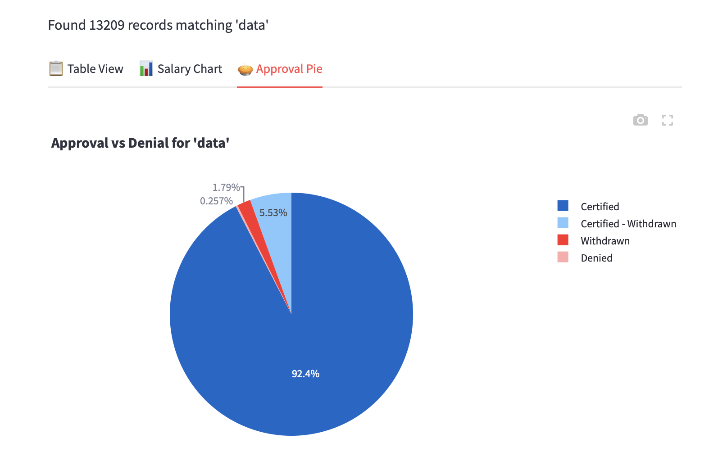
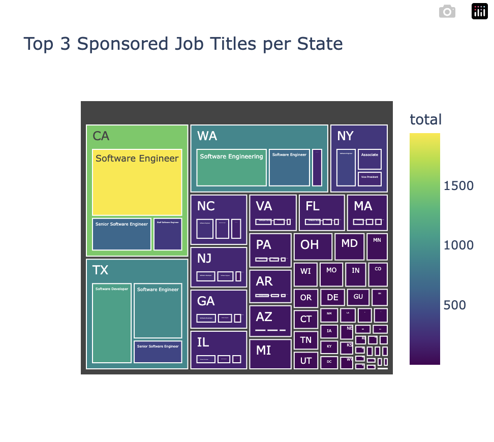
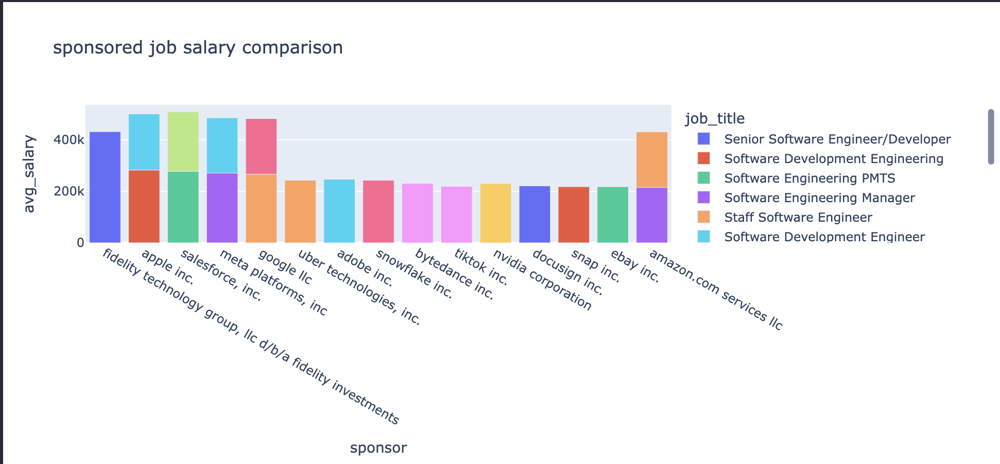
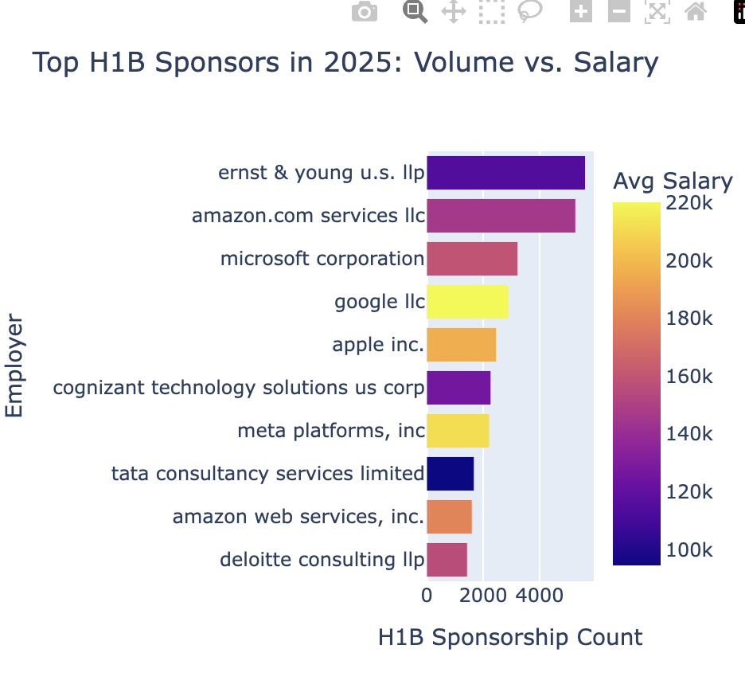

# 📊 H1BView: H-1B Sponsorship Insight Dashboard

An interactive dashboard to explore 2025 Q1–Q2 H-1B visa filings, helping international job seekers discover **sponsor-friendly job titles**, **top-paying employers**, and **approval trends**.

<!--  -->

---

## 🔍 Features

- **Keyword Search**: Filter by job title (e.g., `Data`, `Software`) in the sidebar
- **Top Salary Visualization**: View top 10 employers offering highest median salaries
- **Approval Ratio**: See approval vs. denial case breakdown
- **Export Results**: Download filtered data as CSV
- **Responsive UI**: Streamlit + Plotly interface

---

## 💡 Key Findings

- **Top Sponsors**: Amazon, Google, Meta, and Deloitte are leading H-1B sponsors
- **Popular Job Titles**: Most certified filings are software-related, especially in CA, TX, and WA
- **Salary Differences**: Tech companies generally offer higher salaries than consulting firms
- **Approval Trends**: Most major employers maintain high approval rates

---

## 📈 Visual Highlights

### 🖱️ Interactive Dashboard Search

Try typing a keyword in the sidebar (e.g. `Software`) and view results instantly.





---

### 💰 Top Median Salaries by Employer

Bar chart of certified cases showing the highest median salaries for the selected keyword.



---

### ✅ Approval vs Denial Ratio

Pie chart of approval status distribution based on your search keyword.



---

### 📊 Visualizations in jupiter notebook





## Dataset

- **Source**: U.S. Department of Labor (H-1B Disclosure Data)
- **Scope**: 2025 Q1–Q2 Certified & Denied LCA Applications
- **Fields Used**:
  - `employer`
  - `job_title`
  - `state`
  - `estimated_yearly_salary`
  - `case_status`

---

## ⚠️ Limitations

- **Title Noise**: No standard job title taxonomy (e.g., `SDE I` vs `Senior SWE`)
- **No Entry-Level Flag**: Dataset lacks clear entry-level position label
- **Partial Timeframe**: Includes only filings from Q1–Q2 2025; may not reflect annual trends

---

## 🛠 Tech Stack

| Tool        | Usage                                  |
|-------------|----------------------------------------|
| Python      | Data manipulation (pandas)             |
| Streamlit   | Interactive dashboard UI               |
| Plotly      | Dynamic visualizations (bar, pie)      |
| SQL         | Backend data query                     |
| Tableau     | Additional state-wise visual insights  |

---

## 🚀 How to Run

```bash
pip install streamlit pandas plotly
streamlit run app.py
